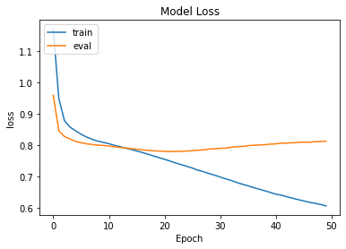

# Recomender System for MovieLens 1M Dataset

## Prerequisites
- Linux or macOS
- Python 3
- CPU or NVIDIA GPU + CUDA CuDNN 

### Getting started

- Clone this repo:
```bash
git clone https://github.com/yilmazgencc/Recomender_System.git
cd Recomender_System
```

- Install PyTorch 3.7 and other dependencies via

- For Conda users,  you can create a new Conda environment using `conda env create -f environment.yml`.

- For pip users, please type the command `pip install -r requirements.txt`.

- Train the UC model:
```bash
python train.py --model $MODEL  --opt $OPTIMIZER  --embedding_dim $EMBEDDING_DIMENSION --epochs $EPOCH_NUMBER 
--batch_size $BATCH_SIZE --lr $LEARNING_RATE --dropout $DROPOUT_RATE
```
- The list arguments is as follows:
- --model: Designed neural network(NN) and confusion matrix(CF) available default="NN"
- --opt: Available optimizer for training( "Adam", "SGD", "RMSprop", "Adagrad") default="Adam"
- --embedding_dim:Embedding layer dimension default=64
- --epochs: Epoch number for training default=25
- --batch_size: Batch size selection default=1024
- --lr:Learning rate for training  default=1e-4
- --dropout: Droput rate for NN default=0.4
- --seed: Random seed number  default=123
- --use_deterministic: Seed activation option action="store_true"
### Result Figure

 | 

## Issues

- Please report all issues on the public forum.
